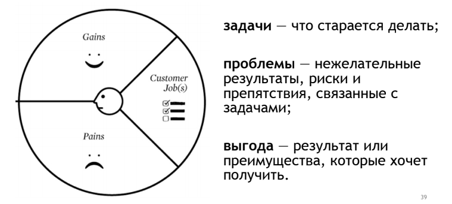

 Мы провели несколько интервью и, проанализировав, ответы пользователей сделали некоторые выводы. Все они описаны ниже, материалы можно посмотреть в [папке](https://drive.google.com/drive/folders/139Jy3cNzCfFVBlAVpxEMMLAnsxrJ7Cou?usp=sharing).
 
 Портрет был разложен на несколько составляющих в соответствии со следующим подходом:
 

**Job Stories**:
* Когда я устал и у меня есть свободное время, я хочу поиграть в игру, чтобы отдохнуть
* Когда мне скучно, я хочу поиграть в игру, чтобы развлечься
* Когда я проснулся утром, я хочу поиграть в игру, чтобы “дать моему мозгу время загрузиться” 

**Задачи**:
* отдохнуть и развлечься
* найти контент
* провести время
* зайти на сайт или скачать игру
* насладиться графикой
* погрузиться в атмосферу
* продвинуться в сюжете

Анализ задач можно прочитать [здесь](https://docs.google.com/document/d/1AeEAGRHkB1ng73g5C8rcICWIUETskSN2m27gxCPhk0A/edit?usp=sharing).

**Проблемы**:
* лень долго искать
* не очень много свободного времени
* слишком сложные задачи/сюжет, чтобы расслабиться
* неинтересный сюжет
* не хватает скилла
* неудобное управление (не хватает мышки / удобной клавиатуры)
* не нравится графика
* не нравится жанр игры

Пользователь испытывает сложности в поиске нового подходящего контента, когда хочет отдохнуть (потому что или нужно приложить усилия и поискать, или игра слишком затратная по мозговым ресурсам, или игра слишком долгая). То есть, пользователь хочет чего-то ненапряжного и не сильно долгого по времени.

**Выгоды**:
* провести время (необходимая)
* получить эстетическое удовольствие (ожидаемая)
* найти пасхалки (неожиданная)
* насладиться хорошей музыкой (неожиданная)
* классная, интересная игра (ожидаемая)
* открыть все ветки сюжета (для некоторых желательная)
* продуманный сюжет (ожидаемая)

По итогам проведенной работы мы сделали вывод, что от данной игры ожидается очень хорошая графика и очень продуманный сюжет, но при этом она не должна напрягать (не логическая) и не должна быть скучной. Также в разработке этой игры необходимо сделать упор на ПК, а импорт на мобильные устройства отложить (например, до того момента, как игру уже полюбят многие) -- так как в игры на мобильных устройствах играют обычно, чтобы скоротать время не дома, а на ПК играют, чтобы отдохнуть/расслабиться дома.

**Опрос**
Сами вопросы для опроса можно найти по [ссылке](https://drive.google.com/open?id=10v6dscq9Ra3wZtFQtV_QKFUKOie5GMZFvUh0fsIcjB0), а результаты представлены в [этом документе](https://drive.google.com/open?id=1CCH4igPadJrkvUIGQlq88K6OtBDvMrjRJMguDyEZLW8).

**Профиль пользователя**
По итогам интервью и опроса были сформулированы следующие тезисы:
* Люди часто проводят свободное время за просмотром сериалов / YouTube
* Чаще всего люди играют на ПК. Однако некоторые предпочитают телефоны, потому что можно удобно расположиться.
* Большинство людей редко играют в игры -- раз в месяц-два.
* Большинство людей играет в несколько любимых игр (1-3).
* Люди готовы платить за игру, если они получат от неё удовольствие и она не разочарует своим качеством.
* Люди готовы поиграть в игру, если им скучно и у них есть время. В этом же случае люди выбирают игры, которые не требуют умственных усилий и особых скиллов.
* Киберпанк -- это мир киборгов и высоких технологий, в котором нет места чувствам и природе.
* Люди ожидают от контента в стиле киберпанк хорошей графики (в 3D), ярких неоновых цветов, ночного времени суток (темноты), * городского пейзажа с кучей зданий и вывесок.

Таким образом, наш пользователь -- это человек, который не самый опытный геймер (небольшой опыт игры в компьютерные игры), который часто смотрит сериалы или YouTube, у него есть 1-3 любимых игры и не очень много свободного времени (чаще всего 1 час, но не более 3 часов).

**Конкуренты**
Нашими прямыми конкурентами являются, например, игра The Red String Club или игра Machinarium, а также сериалы Love Death & Robots и Black Mirror.
Анализ конкурентов можно прочитать [здесь](https://drive.google.com/open?id=1PtVppQXjBwDSH-JVFaRHz9VRPmAhb3uove7QPeY-_YA).
